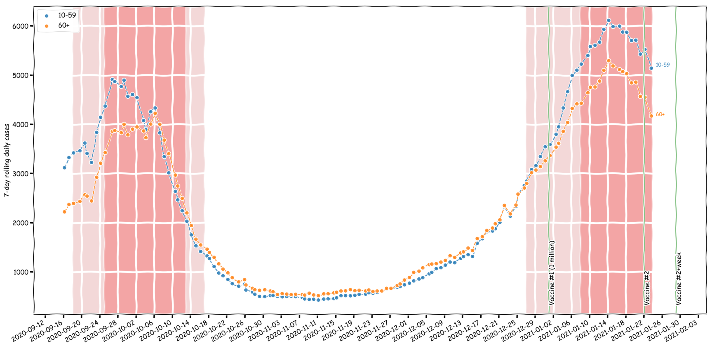

# israel_moh_covid_dashboard_data
Data pulled from the Israeli Minsitry of Health's COVID-19 dashboard's API.

### How to generate a graph
* Install `python3`
* Execute `python -m src.main` from the repository root

Example:

